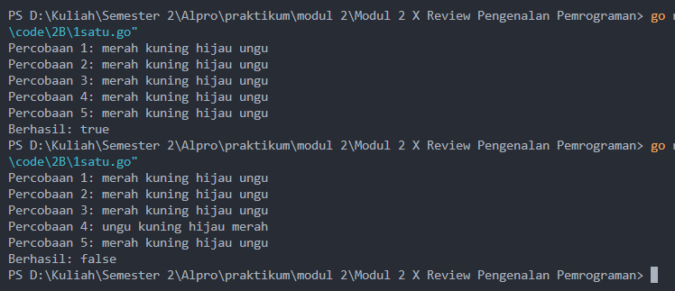
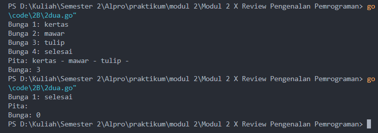
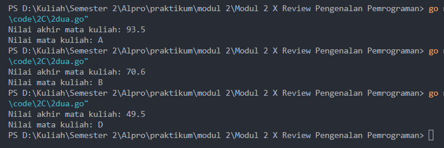

<h1 align="center">Laporan Praktikum Modul 2 <br>Review Pengenalan Pemrograman</h1>
<p align="center">KHANIF YUNAN PRATAMA - 103112430017</p>

## Dasar Teori
Pemrograman dengan bahasa Go memiliki struktur yang sederhana namun kuat, dengan aturan penulisan yang jelas dan efisien. Setiap program utama harus memiliki package main dan func main() sebagai titik awal eksekusi. Proses pengembangan melibatkan penulisan kode dalam file .go, kompilasi menggunakan go build, dan eksekusi melalui terminal. Go menyediakan berbagai tipe data seperti integer, float, boolean, dan string, serta mendukung deklarasi variabel yang fleksibel. Selain itu, bahasa ini memiliki kontrol alur yang mencakup perulangan for dalam berbagai bentuk dan percabangan dengan if-else serta switch-case untuk pengambilan keputusan.

## Unguided

### Soal Latihan 2A

#### Soal 1

> Telusuri program berikut dengan cara mengkompilasi dan mengeksekusi program. Silakan masukan data yang sesuai sebanyak yang diminta program. Perhatikan keluaran yang diperoleh. Coba terangkan apa sebenarnya yang dilakukan program tersebut?

```go
package main

import "fmt"

func main() {

    var (
        satu, dua, tiga string
        temp            string
    )

    fmt.Print("Masukan input string: ")
    fmt.Scanln(&satu)

    fmt.Print("Masukan input string: ")
    fmt.Scanln(&dua)

    fmt.Print("Masukan input string: ")
    fmt.Scanln(&tiga)

    fmt.Println("Output awal = " + satu + " " + dua + " " + tiga)

    temp = satu
    satu = dua
    dua = tiga
    tiga = temp

    fmt.Println("Output akhir = " + satu + " " + dua + " " + tiga)

}
```


Kode diatas merupakan program yang akan menerima tiga buah inputan dari user, kemudian menyimpan inputan tersebut dan menampilkannya kembali. Output yang ditampilkan merupakan output awal yaitu tiga kata yang dimasukan akan disusun secara berurutan, sesuai dengan urutan ketika kita memasukan inputan ke program di awal. Dan untuk output akhir berisikan susunan kata yang berubah, dimana bergeser (Kata 2 menjadi pertama, 3 menjadi 2 dan 1 menjadi 3). Kuncinya adalah ada di perubahan variabel dibawah ini:

```go
temp = satu
satu = dua
dua = tiga
tiga = temp
```

Program diatas menampung 4 variabel, yang dimana ke empat variabel diatas menggunakan tipe data string, yang digunakan untuk menampung inputan dari user.
#### Soal 2

>Tahun kabisat adalah tahun yang habis dibagi 400 atau habis dibagi 4 tetapi tidak habis dibagi 100. Buatlah sebuah program yang menerima input sebuah bilangan bulat dan memeriksa apakah bilangan tersebut merupakan tahun kabisat (true) atau bukan (false).

```go
package main

import "fmt"

func main() {

	var tahun int
	var kabisat bool

	fmt.Print("Masukan tahun: ")
	fmt.Scanln(&tahun)

	if tahun%400 == 0 || tahun%4 == 0 && tahun%100 != 0 {
		kabisat = true
	} else {
		kabisat = false
	}

	fmt.Println("Tahun:", tahun)
	fmt.Println("Kabisat:", kabisat)

}
```


Program ini bertujuan untuk mengecek apakah suatu tahun merupakan tahun kabisat atau bukan. Tahun kabisat adalah tahun yang:
- Habis dibagi 400 (tahun%400 == 0), atau
- Habis dibagi 4 (tahun%4 == 0) tetapi tidak habis dibagi 100 (tahun%100 != 0).

Pada saat program dimulai, program akan meminta user untuk memasukan inputan tahun, kemudiaan program akan memproses tahun yang telah dimasukan, apakah tahun tersebut habis dibagi 400, atau habis dibagi 4 tetapi tidak habis dibagi 100. Ketika persyaratan terpenuhi, maka otomatis output yang ditampilkan adalah true, yaitu benar bahwa tahun tersebut merupakan tahun kabisat. Percabangan dibawah ini merupakan yang mengatur untuk mendapatkan true ataupun false:

```go
if tahun%400 == 0 || tahun%4 == 0 && tahun%100 != 0 {
	kabisat = true
} else {
	kabisat = false
}
```

Pada program diatas, terdapat 2 variabel yaitu:
- tahun (int) yang digunakan untuk menyimpan inputan tahun dan mengolahnya.
- kabisat (bool) yang digunakan untuk menentukan nilai kebenaran dari tahun yang telah diinputkan.

#### Soal 3

>Buat program Bola yang menerima input jari-jari suatu bola (bilangan bulat). Tampilkan Volume dan Luas kulit bola. 𝑣𝑜𝑙𝑢𝑚𝑒𝑏𝑜𝑙𝑎 = 4 3 𝜋𝑟 3 dan 𝑙𝑢𝑎𝑠𝑏𝑜𝑙𝑎 = 4𝜋𝑟 2 (π ≈ 3.1415926535).

```go
package main

import "fmt"

func main() {

	var jariJari int
	var volume, luas, phi float64

	fmt.Print("Masukan jari-jari: ")
	fmt.Scanln(&jariJari)

	phi = 3.1415926535

	volume = 4.0 / 3.0 * phi * float64(jariJari) * float64(jariJari) * float64(jariJari)
	luas = 4.0 * phi * float64(jariJari) * float64(jariJari)

	fmt.Println("Jejari =", jariJari)
	fmt.Printf("Bola dengan jejari %d memiliki volume %.4f dan luas kulit %.4f\n", jariJari, volume, luas)

}
```


Pada saat program dijalankan, program akan meminta pengguna untuk memasukkan jari-jari bola. Nilai jari-jari ini kemudian dikonversi ke tipe float64 untuk memastikan perhitungan dapat dilakukan. Setelah perhitungan selesai, program akan menampilkan hasil volume dan luas permukaan bola dalam empat angka di belakang koma.

```go
phi = 3.1415926535

volume = 4.0 / 3.0 * phi * float64(jariJari) * float64(jariJari) * float64(jariJari)

luas = 4.0 * phi * float64(jariJari) * float64(jariJari)
```

Dalam program ini terdapat tiga variabel utama, yaitu:
- jariJari (int) menyimpan input jari-jari yang dimasukkan oleh pengguna.
- phi (float64) digunakan untuk menyimpan nilai phi yang ditentukan pada soal.
- volume dan luas (float64) menyimpan hasil perhitungan volume dan luas permukaan bola.

#### Soal 4

>Dibaca nilai temperatur dalam derajat Celsius. Nyatakan temperatur tersebut dalam Fahrenheit 𝐶𝑒𝑙𝑠𝑖𝑢𝑠 = (𝐹𝑎ℎ𝑟𝑒𝑛ℎ𝑒𝑖𝑡 − 32) × 5/9 𝑅𝑒𝑎𝑚𝑢𝑟 = 𝐶𝑒𝑙𝑐𝑖𝑢𝑠 × 4/5 𝐾𝑒𝑙𝑣𝑖𝑛 = (𝐹𝑎ℎ𝑟𝑒𝑛ℎ𝑒𝑖𝑡 + 459.67) × 5/9

```go
package main

import "fmt"

func main() {

	var celcius, reamur, fahrenheit int
	var kelvin float32

	fmt.Print("Temperatur Celcius: ")
	fmt.Scanln(&celcius)

	reamur = celcius * 4 / 5
	fahrenheit = celcius*9/5 + 32
	kelvin = (float32(fahrenheit) + 459.67) * 5 / 9

	fmt.Println("Derajat Reamur:", reamur)
	fmt.Println("Derajat Fahrenheit:", fahrenheit)
	fmt.Println("Derajat Kelvin:", int(kelvin))

}
```


Ketika program berjalan, program akan meminta pengguna untuk memasukan inputan berupa suhu dalam satuan celcius, yang kemudian akan di konversi ke beberapa satuan lainnya, yaitu ke fahrenheit, reamur dan kelvin.  Berikut ini merupakan rumus yang disimpan dalam masing-masing variabel:

```go
reamur = celcius * 4 / 5
fahrenheit = celcius*9/5 + 32
kelvin = (float32(fahrenheit) + 459.67) * 5 / 9
```

#### Soal 5

>Tipe karakter sebenarnya hanya apa yang tampak dalam tampilan. Di dalamnya tersimpan dalam bentuk biner 8 bit (byte) atau 32 bit (rune) saja. Buat program ASCII yang akan membaca 5 buat data integer dan mencetaknya dalam format karakter. Kemudian membaca 3 buah data karakter dan mencetak 3 buah karakter setelah karakter tersebut (menurut tabel ASCII) Masukan terdiri dari dua baris. Baris pertama berisi 5 buah data integer. Data integer mempunyai nilai antara 32 s.d. 127. Baris kedua berisi 3 buah karakter yang berdampingan satu dengan yang lain (tanpa dipisahkan spasi). Keluaran juga terdiri dari dua baris. Baris pertama berisi 5 buah representasi karakter dari data yang diberikan, yang berdampingan satu dengan lain, tanpa dipisahkan spasi. Baris kedua berisi 3 buah karakter (juga tidak dipisahkan oleh spasi).

```go
package main

import "fmt"

func main() {

	var kode1, kode2, kode3, kode4, kode5 int
	var huruf1, huruf2, huruf3 rune

	fmt.Scan(&kode1, &kode2, &kode3, &kode4, &kode5)
	fmt.Scanln()
	fmt.Scanf("%c%c%c\n", &huruf1, &huruf2, &huruf3)

	huruf1 += 1
	huruf2 += 1
	huruf3 += 1

	fmt.Printf("%c%c%c%c%c\n", kode1, kode2, kode3, kode4, kode5)
	fmt.Printf("%c%c%c\n", huruf1, huruf2, huruf3)
}
```


Program diatas digunakan untuk membaca 5 kode ASCII berbeda yang nantinya dari 5 kode tersebut akan langsung di konversi ke dalam bentuk huruf dan dijadikan satu sehingga membentuk suatu kata. Selain itu program diatas digunakan juga untuk menggeser karakter. Jadi permisalan kita akan menggeser masing-masing karakter dari kata SNO. Maka ketika dijalankan, S akan berubah menjadi T (huruf setelah S), N menjadi O dan O menjadi P. Masing-masing karakter akan bergeser satu. Kuncinya ada di penggunaan tipe data rune, yang digunakan untuk menyimpan masing masing karakter.  

### Soal Latihan 2B

#### Soal 1

> Siswa kelas IPA di salah satu sekolah menengah atas di Indonesia sedang mengadakan praktikum kimia. Di setiap percobaan akan menggunakan 4 tabung reaksi, yang mana susunan warna cairan di setiap tabung akan menentukan hasil percobaan. Siswa diminta untuk mencatat hasil percobaan tersebut. Percobaan dikatakan berhasil apabila susunan warna zat cair pada gelas 1 hingga gelas 4 secara berturutan adalah ‘merah’, ‘kuning’, ‘hijau’, dan ‘ungu’ selama 5 kali percobaan berulang. Buatlah sebuah program yang menerima input berupa warna dari ke 4 gelas reaksi sebanyak 5 kali percobaan. Kemudian program akan menampilkan true apabila urutan warna sesuai dengan informasi yang diberikan pada paragraf sebelumnya, dan false untuk urutan warna lainnya.

```go
package main

import "fmt"

func main() {

	var gelas1, gelas2, gelas3, gelas4 string
	var berhasil bool

	berhasil = true

	for i := 1; i <= 5; i++ {
		fmt.Print("Percobaan ", i, ": ")
		fmt.Scan(&gelas1, &gelas2, &gelas3, &gelas4)

		if !(gelas1 == "merah" && gelas2 == "kuning" && gelas3 == "hijau" && gelas4 == "ungu") {
			berhasil = false
		}
	}

	fmt.Print("Berhasil: ", berhasil)

}
```


Program ini digunakan untuk mengecek keberhasilan percobaan kimia berdasarkan urutan warna dalam empat gelas. Jika dalam 5 percobaan berturut-turut urutan warna selalu "merah, kuning, hijau, ungu", maka percobaan dianggap berhasil (true). Jika ada satu saja percobaan yang tidak sesuai, maka hasil akhirnya adalah gagal (false).

#### Soal 2

> Suatu pita (string) berisi kumpulan nama-nama bunga yang dipisahkan oleh spasi dan ‘– ‘, contoh pita diilustrasikan seperti berikut ini. Pita: mawar – melati – tulip – teratai – kamboja – anggrek Buatlah sebuah program yang menerima input sebuah bilangan bulat positif (dan tidak nol) N, kemudian program akan meminta input berupa nama bunga secara berulang sebanyak N kali dan nama tersebut disimpan ke dalam pita. (Petunjuk: gunakan operasi penggabungan string dengan operator “+” ). Tampilkan isi pita setelah proses input selesai.

```go
package main

import "fmt"

func main() {

	var bunga, pita string
	var jumlah int

	jumlah = 0

	for {

		fmt.Print("Bunga ", jumlah+1, ": ")
		fmt.Scan(&bunga)

		if bunga == "selesai" {
			break
		}

		pita = pita + bunga + " - "
		jumlah++

	}

	fmt.Println("Pita:", pita)
	fmt.Println("Bunga:", jumlah)

}
```


Program ini digunakan untuk mengumpulkan nama-nama bunga ke dalam sebuah pita string yang dipisahkan dengan tanda "-" hingga pengguna mengetik "selesai" sebagai input. Selain itu, program juga menghitung jumlah bunga yang telah dimasukkan.

#### Soal 3

> Setiap hari Pak Andi membawa banyak barang belanjaan dari pasar dengan mengendarai sepeda motor. Barang belanjaan tersebut dibawa dalam kantong terpal di kiri-kanan motor. Sepeda motor tidak akan oleng jika selisih berat barang di kedua kantong sisi tidak lebih dari 9 kg. Buatlah program Pak Andi yang menerima input dua buah bilangan real positif yang menyatakan berat total masing-masing isi kantong terpal. Program akan terus meminta input bilangan tersebut hingga salah satu kantong terpal berisi 9 kg atau lebih.

```go
package main

import "fmt"

func main() {

	var kantong1, kantong2, selisih float32
	var oleng bool

	for {
		fmt.Print("Masukan berat belanjaan di kedua kantong: ")
		fmt.Scan(&kantong1, &kantong2)

		if kantong1 < 0 || kantong2 < 0 {
			fmt.Println("Proses selesai")
			break
		}

		if kantong1+kantong2 > 150 {
			fmt.Println("Proses selesai")
			break
		}

		if kantong1 > kantong2 {
			selisih = kantong1 - kantong2
		} else {
			selisih = kantong2 - kantong1
		}

		oleng = selisih >= 9
		fmt.Println("Sepeda motor pak Andi akan oleng:", oleng)
	}

}
```

Program ini digunakan untuk mengecek keseimbangan sepeda motor Pak Andi saat membawa belanjaan dalam dua kantong. Sepeda motor dianggap oleng jika perbedaan berat antara kantong kiri dan kanan 9 kg atau lebih. Program juga akan berhenti jika:
- Salah satu kantong memiliki berat negatif.
- Total berat kedua kantong lebih dari 150 kg.

#### Soal 4
> Diberikan sebuah persamaan sebagai berikut ini. 𝑓(𝑘) = (4𝑘 + 2) 2 (4𝑘 + 1)(4𝑘 + 3) Buatlah sebuah program yang menerima input sebuah bilangan sebagai K, kemudian menghitung dan menampilkan nilai f(K) sesuai persamaan di atas.

```go
package main

import (
	"fmt"
	"math"
)

func main() {
	var k int

	fmt.Print("Nilai K: ")
	fmt.Scan(&k)

	result := 1.0

	for i := 0; i < k; i++ {
		numerator := math.Pow(float64(4*i+2), 2)
		denumerator := float64((4*i + 1) * (4*i + 3))
		result *= numerator / denumerator
	}

	fmt.Printf("Hasil dari operasi fungsi = %.10f\n", result)
}
```


Program ini menerima input bilangan bulat K dari pengguna, lalu menghitung nilai fungsi tersebut menggunakan perulangan. Hasil perhitungan ditampilkan dengan 10 angka di belakang koma.

### Soal Latihan 2C

#### Soal 1

> PT POS membutuhkan aplikasi perhitungan biaya kirim berdasarkan berat parsel. Maka, buatlah program BiayaPos untuk menghitung biaya pengiriman tersebut dengan ketentuan sebagai berikut! Dari berat parsel (dalam gram), harus dihitung total berat dalam kg dan sisanya (dalam gram). Biaya jasa pengiriman adalah Rp. 10.000,- per kg. Jika sisa berat tidak kurang dari 500 gram, maka tambahan biaya kirim hanya Rp. 5,- per gram saja. Tetapi jika kurang dari 500 gram, maka tambahan biaya akan dibebankan sebesar Rp. 15,- per gram. Sisa berat (yang kurang dari 1kg) digratiskan biayanya apabila total berat ternyata lebih dari 10kg.

```go
package main

import "fmt"

func main() {

	var berat, kg, gram, harga int

	fmt.Print("Berat parsel (gram): ")
	fmt.Scanln(&berat)

	kg = berat / 1000
	gram = berat % 1000

	fmt.Println("Detail berat:", kg, "kg", "+", gram, "gram")

	if gram >= 500 {
		gram = gram * 5
	} else {
		gram = gram * 15
	}

	if kg < 10 {
		kg = kg * 10000
		harga = kg + gram
	} else {
		kg = kg * 10000
		harga = kg
	}

	fmt.Println("Detail biaya: Rp", kg, "+ Rp", gram)
	fmt.Println("Total biaya: Rp", harga)

}
```


Program ini digunakan untuk menghitung biaya pengiriman parsel berdasarkan beratnya dalam gram. Biaya dihitung berdasarkan ketentuan: 
1. Berat diubah ke satuan kg dan gram.
2. Biaya per kg = Rp 10.000.
3. Tambahan biaya untuk gram:
	- Jika gram >= 500, biaya tambahan Rp 5 per gram.
	- Jika gram >= 500, biaya tambahan Rp 15 per gram.
4. Jika total berat >= 10 kg, maka biaya untuk per gramnya digratiskan.
5. Total biaya adalah jumlah biaya kg + biaya gram (atau hanya biaya kg jika > 10 kg).

#### Soal 2

> Jawablah pertanyaan-pertanyaan berikut: 
> a. Jika nam diberikan adalah 80.1, apa keluaran dari program tersebut? Apakah eksekusi program tersebut sesuai spesifikasi soal? 
> b. Apa saja kesalahan dari program tersebut? Mengapa demikian? Jelaskan alur program seharusnya! 
> c. Perbaiki program tersebut! Ujilah dengan masukan: 93.5; 70.6; dan 49.5. Seharusnya keluaran yang diperoleh adalah ‘A’, ‘B’, dan ‘D’.

##### Kode Awal
```go
package main
import “fmt”
func main() {
 var nam float64
 var nmk string
 fmt.Print(“Nilai akhir mata kuliah: “)
 fmt.Scanln(&nam)
 if nam > 80 {
 nam = “A”
 }
 if nam > 72.5 {
 nam = “AB”
 }
 if nam > 65 {
 nam = “B”
 }
 if nam > 57.5 {
 nam = “BC”
 }
 if nam > 50 {
 nam = “C”
 }
 if nam > 40 {
 nam = “D”
 } else if nam <= 40 {
 nam = “E”
 }
 fmt.Println(“Nilai mata kuliah: “, nmk)
}
```

##### Kode Setelah Perbaikan
```go
package main

import "fmt"

func main() {

	var nam float64
	var nmk string

	fmt.Print("Nilai akhir mata kuliah: ")
	fmt.Scanln(&nam)

	if nam > 80 {
		nmk = "A"
	} else if nam > 72.5 && nam <= 80 {
		nmk = "AB"
	} else if nam > 65 && nam <= 72.5 {
		nmk = "B"
	} else if nam > 57.5 && nam <= 65 {
		nmk = "BC"
	} else if nam > 50 && nam <= 57.5 {
		nmk = "C"
	} else if nam > 40 && nam <= 50 {
		nmk = "D"
	} else if nam <= 40 {
		nmk = "E"
	}

	fmt.Println("Nilai mata kuliah:", nmk)
}
```


a. Ketika program awal dijalankan, output yang ditambilkan tidak sesuai dengan kriteria. Dikarenakan terdapat beberapa kesalahan pada program yang harus diperbaiki.
b. Cukup banyak kesalahan pada program. Kesalahannya yaitu: 
	- Pada kode diatas menggunakan banyak sekali percabangan dan tidak menggunakan else if, sehingga eksekusi program bertumpuk.
	- variabel yang digunakan untuk menyimpan output salah, yaitu seharunya menggunakan variabel nmk yang bertipe data string, bukan nam yang memiliki tipe data float64.
	- Tidak ada pembatasan pada percabangan, yang dimana tidak ditentukan nilai A itu dari rentan berapa sampai berapa. Begitu juga dengan nilai B, C, D dan E.
	- Tanda petik 2 yang digunakan tidak tepat.
c. Ketika program sudah diperbaiki dan dicoba, output yang ditampilkan sudah sesuai dengan yang tertera pada output.

#### Soal 3

> Sebuah bilangan bulat b memiliki faktor bilangan f > 0 jika f habis membagi b. Contoh: 2 merupakan faktor dari bilangan 6 karena 6 habis dibagi 2. Buatlah program yang menerima input sebuah bilangan bulat b dan b > 1. Program harus dapat mencari dan menampilkan semua faktor dari bilangan tersebut!
> Bilangan bulat b > 0 merupakan bilangan prima p jika dan hanya jika memiliki persis dua faktor bilangan saja, yaitu 1 dan dirinya sendiri. Lanjutkan program sebelumnya. Setelah menerima masukan sebuah bilangan bulat b > 0. Program tersebut mencari dan menampilkan semua faktor bilangan tersebut. Kemudian, program menentukan apakah b merupakan bilangan prima.

```go
package main

import "fmt"

func main() {

	var bilangan, faktor int
	var prima bool

	fmt.Print("Bilangan: ")
	fmt.Scan(&bilangan)

	fmt.Print("Faktor: ")
	for i := 1; i <= bilangan; i++ {

		if bilangan%i == 0 {
			fmt.Print(i, " ")
			faktor++
		}

	}

	fmt.Println()

	if faktor == 2 {
		prima = true
	} else {
		prima = false
	}

	fmt.Println("Prima:", prima)
}
```


Program diatas digunakan untuk mengetahui angka mana saja yang bisa membagi habis angka yang dimasukan di awal. Ketika program berjalan, maka otomatis program pengguna untuk memasukan inputan berupa bilangan bulat. Kemudian setelah menginputkan angka, maka otomatis program berjalan dan akan melakukan perulangan yang dimana perulangan akan berhenti di angka yang dimasukan. Perulangan akan menyeleksi angka mana saja yang bisa membagi habis.

```go
for i := 1; i <= bilangan; i++ {

	if bilangan%i == 0 {
		fmt.Print(i, " ")
		faktor++
	}

}
```

